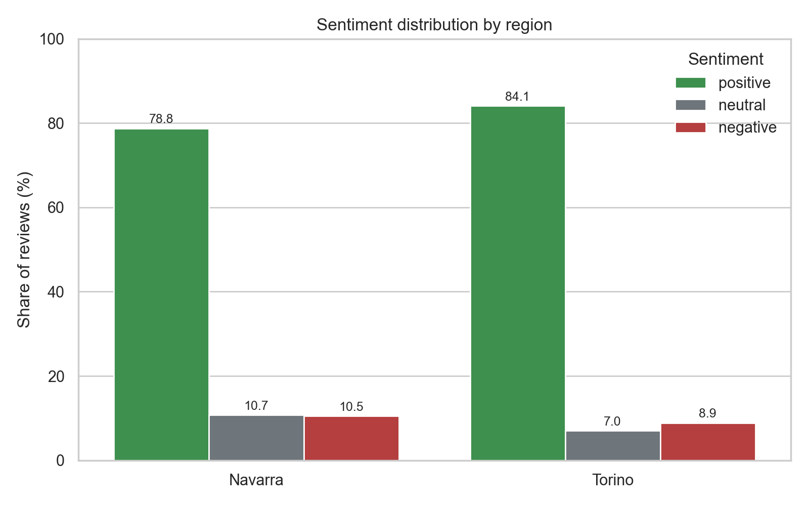
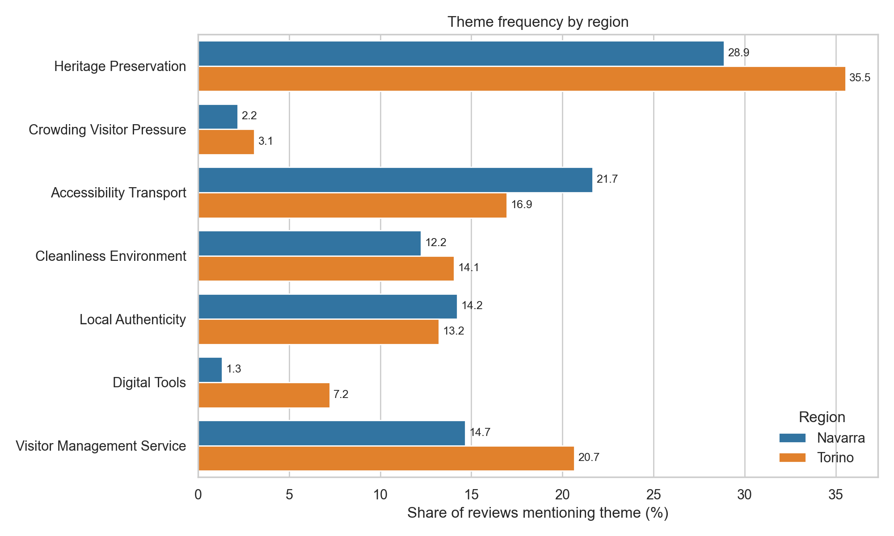
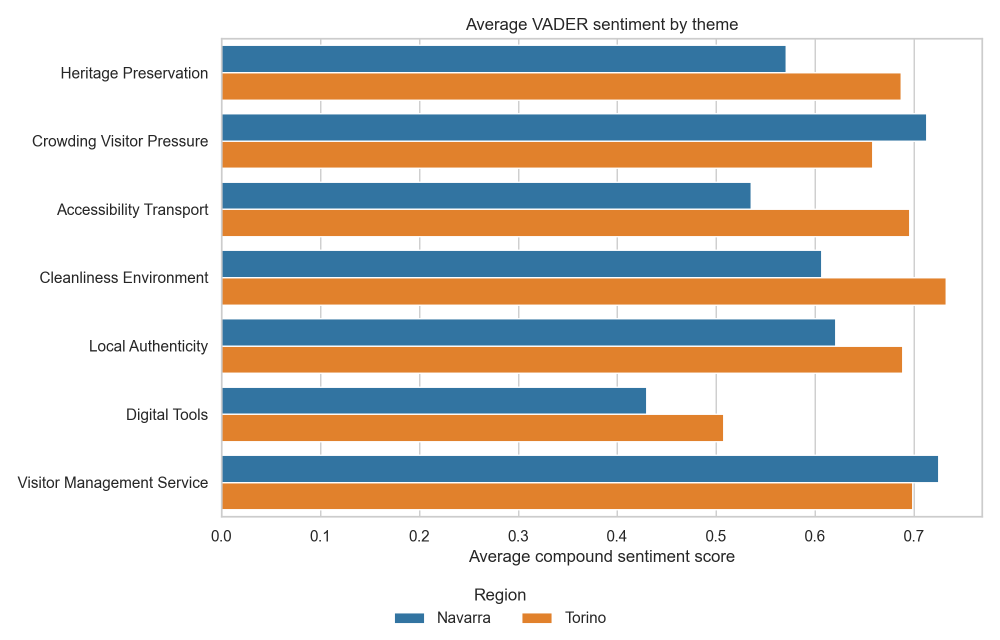
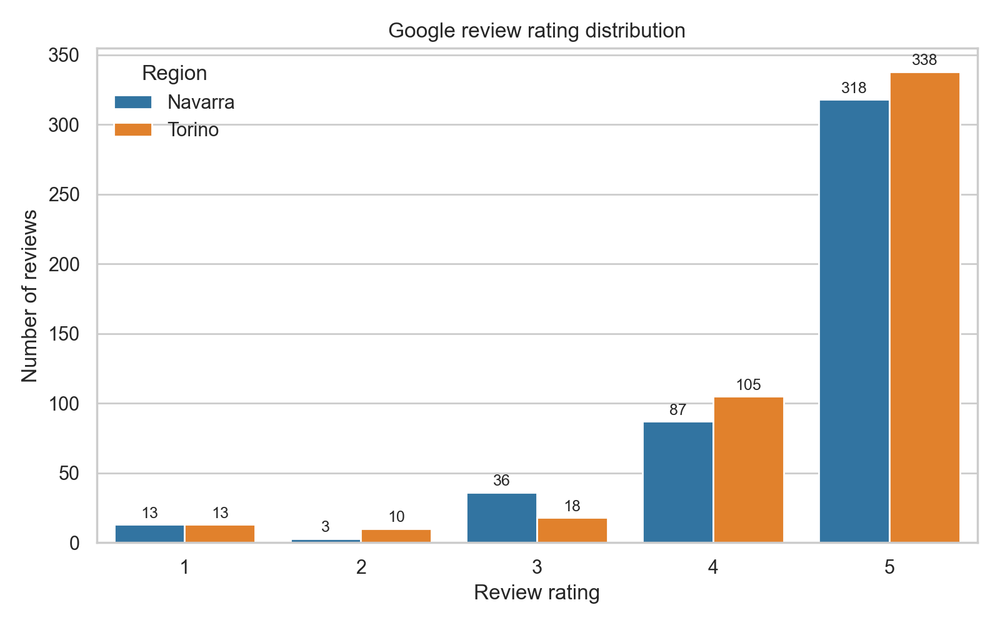
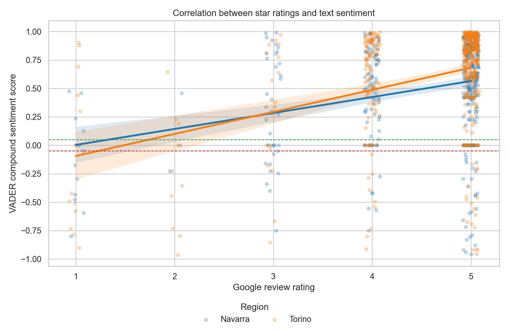

# Sentiment Analysis of Cultural Tourism Reviews in Navarra and Torino

## Introduction

Sustainable cultural tourism needs a good understanding of how visitors feel about places, services, and visitor management. Online reviews are useful for this purpose because they contain direct comments from tourists after visiting attractions. Previous research has also shown that user-generated content can support destination and attraction management (Chemin et al., 2025).

This project is a small proof-of-concept demo. It compares Google Places reviews from cultural attractions in Navarra, Spain, and Torino, Italy. These two regions were selected because both have rich cultural tourism resources, including museums, monuments, historic sites, religious heritage, palaces, castles, and urban heritage areas. The aim is not to produce a final representative study, but to show that a simple and reproducible sentiment analysis workflow is feasible in cultural tourism study.

## Research Questions

1. Are tourists' reviews of cultural attractions in Navarra and Torino generally positive, neutral, or negative?
2. When reviews mention sustainability-related issues, such as heritage preservation, crowding, transport, local culture, cleanliness, visitor management, and digital tools, do sentiments differ between the two regions?

## Data and Methods

### Data Source

The data were collected with the Google Places API. The collection process used Text Search to find cultural attractions and Place Details to retrieve place information and reviews.

Google Places API returns only five reviews per place. For this reason, the dataset is broad across many places rather than deep for a few famous attractions. This is important for the research design.

### Ethics, Data Use, and Copyright Statement

This demo uses Google Places API data only for a proof-of-concept analysis. The repository does not redistribute the downloaded raw Google review dataset. The analysis reports only aggregate results, summary tables, and figures.

Google Maps Platform content is subject to Google Maps Platform policies and terms. Google Maps content and review text must be used with proper attribution.

Reviews are written by users and displayed through Google. This project does not claim ownership of review text. If Google-derived content is displayed, Google attribution is required.


Attribution text: <span translate="no">Google Maps</span>

For privacy reasons, the collection script does not store review author names in new outputs. The analysis does not profile individual users.

### Sampling

The workflow collected:

- 200 unique places in Navarra
- 200 unique places in Torino
- places deduplicated by `place_id`
- up to 5 reviews per place, following the Google Places API limit

The complete collected dataset contains:

- 400 places
- 1,822 reviews
- 0 duplicated `place_id` values

For the demo analysis, a balanced sample was used:

- 1,000 reviews before cleaning
- 941 reviews after cleaning and deduplication
- 457 reviews from Navarra
- 484 reviews from Torino

### Data Structure Example

The repository does not publish the downloaded raw review CSV files. The anonymized example below shows the structure of one review record used locally for analysis:

```text
region: Navarra, Spain
place_name: Museum of Navarre
place_types: art_museum|tourist_attraction|museum
place_rating: 4.4
user_rating_count: 1565
review_language: en
review_rating: 5
review_publish_time: 2026-05-27T15:40:38.656212005Z
review_text_excerpt: "We walk in and we are welcomed, very interesting stuff inside. Worth visiting and the staff are very friendly though it's hard to communicate they speak a little English.I ask some information about the exhibition display and the stafuf tried her best to answer so thank you so much."
```

### Sentiment Analysis

Sentiment analysis was conducted with VADER. VADER gives a compound score for each review. The score was converted into three labels:

- `positive`: compound score >= 0.05
- `negative`: compound score <= -0.05
- `neutral`: compound score between -0.05 and 0.05

### Rating-Sentiment Correlation

As a simple methodological check, Google review ratings were compared with VADER compound sentiment scores. Spearman correlation was used because star ratings are ordinal values. Pearson correlation was also calculated as a secondary check.

### Keyword Theme Coding

The analysis also used keyword-based thematic coding. This means that each review was checked for words related to selected themes. A review can belong to more than one theme.

The themes were:

- heritage preservation
- crowding and visitor pressure
- accessibility and transport
- cleanliness and environment
- local authenticity
- digital tools
- visitor management and service

The full keyword list is available in [theme_keywords.json](work/google_places_navarra_test/theme_keywords.json).

This approach is transparent and easy to reproduce. However, it is a simple demo method. A full study should validate the coding scheme with manual checks or more advanced multilingual models.

## Results

### Overall Sentiment

Both regions received mostly positive reviews.

| Region | Reviews | Positive | Neutral | Negative | Average VADER Score |
|---|---:|---:|---:|---:|---:|
| Navarra | 457 | 78.8% | 10.7% | 10.5% | 0.497 |
| Torino | 484 | 84.1% | 7.0% | 8.9% | 0.593 |

Torino had a slightly higher positive share than Navarra. The difference is also visible in the average VADER score: Torino scored 0.593, while Navarra scored 0.497.



### Theme Frequency

The most common theme in both regions was heritage preservation. It appeared in 28.9% of Navarra reviews and 35.5% of Torino reviews.

Accessibility and transport appeared more often in Navarra reviews than in Torino reviews:

- Navarra: 21.7%
- Torino: 16.9%

Digital tools appeared much more often in Torino reviews:

- Navarra: 1.3%
- Torino: 7.2%

Visitor management and service also appeared more often in Torino:

- Navarra: 14.7%
- Torino: 20.7%



### Sentiment by Theme

The average sentiment score was positive for all themes in both regions. This means that sustainability-related comments were not mainly negative in this sample.

For heritage preservation, Torino had a higher average sentiment score:

- Navarra: 0.571
- Torino: 0.687

For accessibility and transport, Torino also had a higher score:

- Navarra: 0.535
- Torino: 0.696

Digital tool comments were less frequent, but they were more visible in Torino. The average digital tools sentiment was:

- Navarra: 0.430
- Torino: 0.508



### Review Rating

The Google review ratings were also high in both regions:

- Navarra average review rating: 4.519
- Torino average review rating: 4.539

This supports the VADER result that most tourist comments were positive.



### Rating-Sentiment Correlation

The correlation between Google star ratings and VADER compound sentiment scores was positive and statistically significant, but weak.

| Group | Reviews | Spearman rho | Pearson r |
|---|---:|---:|---:|
| All reviews | 941 | 0.236 | 0.328 |
| Navarra | 457 | 0.238 | 0.282 |
| Torino | 484 | 0.232 | 0.371 |

This result suggests that text sentiment and star ratings move in the same direction, but they are not the same measure. Star ratings give a simple evaluation, while review text can include more detailed experiences.



## Discussion

The results answer the two research questions in a simple way.

First, tourist reviews of cultural attractions in both regions are mostly positive. Torino is slightly more positive than Navarra, but both regions have strong visitor satisfaction.

Second, sustainability-related themes show different patterns. Navarra reviews mention accessibility and transport more often. This may reflect the importance of mobility, walking, parking, and access in a region with dispersed heritage places and natural-cultural sites. Torino reviews mention heritage preservation, visitor service, and digital tools more often. This may reflect the dense urban cultural offer of Torino, where museums, palaces, churches, and managed visitor services are highly visible.

The digital tools result is especially useful for this demo. Digital tools were mentioned in only 1.3% of Navarra reviews, compared with 7.2% of Torino reviews. This may be related to Torino's wider smart tourism profile, as the city was selected as the 2025 European Capital of Smart Tourism (European Commission, 2025). However, this does not prove that Torino is more digitally advanced than Navarra. It only shows that digital tourism services are more visible in this specific Google Places review sample.

The rating-sentiment correlation provides a useful validity check. The Spearman correlation is positive for all reviews (rho = 0.236), Navarra (rho = 0.238), and Torino (rho = 0.232). This means that VADER scores are broadly consistent with star ratings, but the relationship is not strong. This is expected because review text often includes mixed comments, short praise, or specific complaints even when the star rating is high.

The findings are consistent with the idea that user-generated reviews can help researchers and managers understand tourist experiences. They can show not only general satisfaction, but also practical issues such as access, service, crowding, and digital tools.

## Limitations

This project has several limitations:

- Google Places API returns up to 5 reviews per place, so this is not a full review archive.
- The sample is a proof-of-concept demo, not a representative final dataset.
- The analysis is mostly based on English reviews.
- VADER is useful for short English texts, but it is not perfect for multilingual tourism reviews.
- Keyword theme coding is transparent, but it may miss synonyms or misunderstand context.
- Some place categories may be broader than cultural tourism, so manual checking would improve the sample.

## Conclusion

This demo shows that Google Places reviews can be used to build a simple and reproducible sentiment analysis workflow for sustainable cultural tourism research. The results show that reviews in both Navarra and Torino are mostly positive. Torino has slightly higher sentiment scores and more digital tool mentions, while Navarra has more accessibility and transport mentions.

For a further study, this workflow could be expanded with larger authorized datasets, multilingual sentiment models, manual validation of themes, and comparison with visitor surveys or destination management data.

## Reproducibility

Install the required packages:

```bash
pip install -r requirements.txt
```

Run the analysis:

```bash
python work/google_places_navarra_test/analyze_reviews.py
python work/google_places_navarra_test/correlation_analysis.py
```

Main input:

```text
outputs/google_places_navarra_torino_combined/reviews_1000_balanced.csv
```

This input file is not intended for public redistribution. Please use Google Places API to collect data.

Main outputs:

```text
outputs/google_places_navarra_torino_analysis/analyzed_reviews.csv
outputs/google_places_navarra_torino_analysis/summary_metrics.csv
outputs/google_places_navarra_torino_analysis/theme_summary.csv
outputs/google_places_navarra_torino_analysis/rating_sentiment_correlation.csv
outputs/google_places_navarra_torino_analysis/*.png
```

To collect new Google Places data, set an API key in the environment:

```bash
export GOOGLE_MAPS_API_KEY="YOUR_API_KEY"
```

Then run the collection script with region-specific query files. The API key is not stored in the code.

### Adapting the Workflow to Other Study Areas

This workflow is designed to be general. The current demo uses Navarra and Torino, but the same scripts can be reused for other regions or cities.

To change the study area, update these files or settings:

- Search queries: edit [navarra_queries.txt](work/google_places_navarra_test/navarra_queries.txt) and [torino_queries.txt](work/google_places_navarra_test/torino_queries.txt), or create new query files for the new regions.
- Data collection settings: change `--region`, `--region-code`, `--address-filter`, `--max-places`, and `--output-dir` when running [fetch_places_reviews.py](work/google_places_navarra_test/fetch_places_reviews.py).
- Dataset combination: update the input and output folders in [combine_datasets.py](work/google_places_navarra_test/combine_datasets.py) if the region names or folder names change.
- Region labels and colors: update `REGION_LABELS` and `REGION_COLORS` in [analyze_reviews.py](work/google_places_navarra_test/analyze_reviews.py) and `REGION_COLORS` in [correlation_analysis.py](work/google_places_navarra_test/correlation_analysis.py).
- Keyword theme coding: edit [theme_keywords.json](work/google_places_navarra_test/theme_keywords.json) if the new study area needs different sustainability or cultural tourism themes.

For example, a new region can be collected by changing the region name, country code, address filter, and query file:

```bash
python work/google_places_navarra_test/fetch_places_reviews.py \
  --region "New Region, Country" \
  --region-code "XX" \
  --queries-file work/google_places_navarra_test/new_region_queries.txt \
  --address-filter "New Region" \
  --max-places 200 \
  --output-dir outputs/google_places_new_region
```

## Distribution and Reuse

The code, documentation, aggregate tables, and figures in this repository are free to use, share, and adapt for academic and educational purposes.

This free distribution statement does not apply to Google Maps Platform content or Google review text. Google-derived content remains subject to Google Maps Platform policies and terms, and the raw review dataset is not redistributed in this repository.

## References

Chemin, M., Silva, C. P. D., & Vikou, S. V. D. P. (2025). *User-generated content (UGC) in tourist attractions and destinations: systematic literature review and perspectives for management*.

Google Maps Platform. (2026). *Places API documentation*. https://developers.google.com/maps/documentation/places/web-service/overview

Google Maps Platform. (2026). *Place resource: reviews*. https://developers.google.com/maps/documentation/places/web-service/reference/rest/v1/places

Google Maps Platform. (2026). *Policies and attributions for Places API*. https://developers.google.com/maps/documentation/places/web-service/policies

European Commission. (2025). Torino - 2025 European Capital of Smart Tourism. European Capital and Green Pioneer of Smart Tourism. https://smart-tourism-capital.ec.europa.eu/torino-2025-european-capital-smart-tourism_en

Hutto, C. J., & Gilbert, E. (2014). *VADER: A parsimonious rule-based model for sentiment analysis of social media text*. Proceedings of the International AAAI Conference on Web and Social Media.
